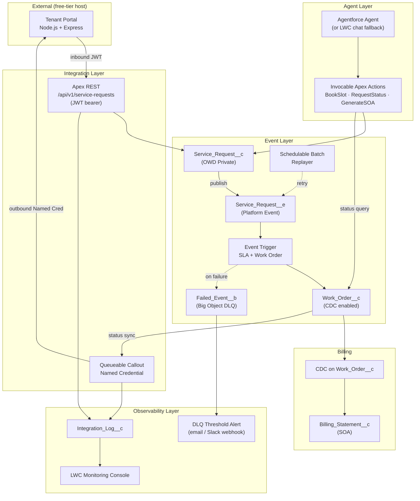
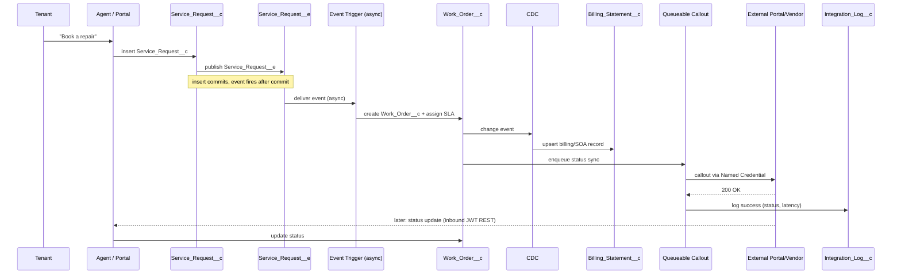
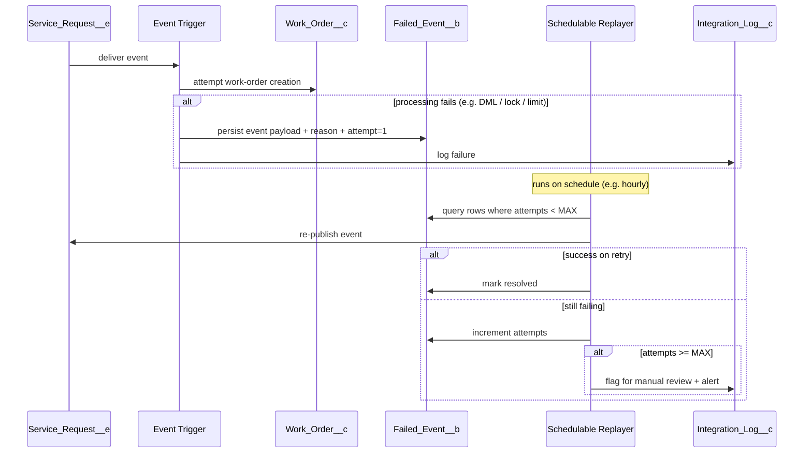
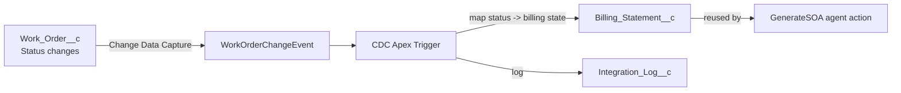
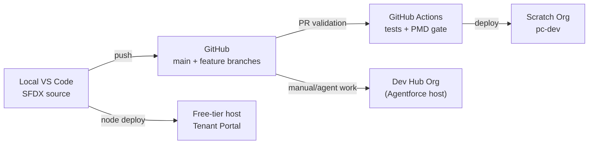

## A. The five logical layers

| Layer | Responsibility | Key components | Built in |
|---|---|---|---|
| **Agent (AI) layer** | Tenant-facing intake & queries | Agentforce agent / LWC chat, 3 invocable Apex actions | Phase 7 |
| **Event layer** | Decouple intake from processing | `Service_Request__e`, event trigger, async work-order creation, retry/DLQ | Phase 5, 6, 14 |
| **Integration layer** | Bidirectional sync with external portal/vendor | Inbound JWT REST, outbound Named Credential + Queueable | Phase 10, 11, 12 |
| **Security layer** | Tenant data isolation & access control | OWD Private, sharing, FLS (`stripInaccessible`), Connected App/JWT, permission sets | Phase 4 |
| **Observability layer** | Visibility & alerting | `Integration_Log__c`, LWC monitoring console, DLQ alert | Phase 13 |

---

## B. High-level component diagram



---

## C. Sequence diagram — happy path (request → work order → vendor sync)



---

## D. Sequence diagram — failure & retry (dead-letter path)



---

## E. Sequence diagram — agent action with security & guardrails

```mermaid
sequenceDiagram
    participant T as Tenant
    participant AG as Agent
    participant ACT as Invocable Apex Action
    participant SEC as Security (sharing + FLS)
    participant DB as Salesforce Data

    T->>AG: "What's the status of request SR-123?"
    AG->>ACT: invoke RequestStatus(requestId, tenantContext)
    ACT->>SEC: query with "with sharing" + stripInaccessible
    SEC->>DB: SOQL scoped to tenant's own records
    alt record belongs to tenant
        DB-->>ACT: record
        ACT-->>AG: status
    else not found / not owned
        ACT-->>AG: "No request found for your account"
        Note over ACT,AG: never reveal another tenant's data;<br/>never fabricate an ID
    end
    alt low model confidence
        AG->>AG: escalate to human queue
    end
```

---

## F. Data flow diagram — billing propagation via CDC



---

## G. Deployment / environment topology



---

## H. Architectural decisions recorded here (full ADRs written in Phase 19)

These are the decisions the diagrams encode; note them now so Phase 19's ADR files just expand them:

1. **Platform Event between request and work order** (not direct DML in the agent action) — decouples intake latency from processing, enables retry/DLQ.
2. **Queueable for callouts** (not `@future`, not trigger-direct) — chaining, better limits, testable, keeps DML and callouts separated.
3. **Big Object as DLQ** — cheap, high-volume, durable; reuses existing Big Objects skill.
4. **OWD Private + sharing for tenant isolation** (not role hierarchy alone) — least-privilege by default; isolation is provable with a negative test.
5. **CDC for billing propagation** (not synchronous trigger chaining) — decouples billing from work-order transaction, avoids long transactions.
6. **Flow for SLA/notification orchestration** (not Apex) — declarative, admin-maintainable, justified placement.
7. **Permission sets over profiles** — deterministic deploys, CI-friendly.

---